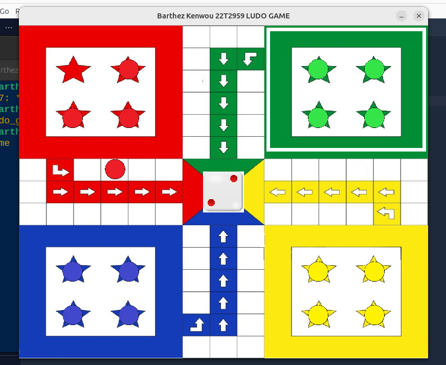

# Ludo Game

Le Ludo est un jeu de société populaire qui se joue généralement à 2, 3 ou 4 joueurs. Dans notre cas on vas faire un jeu de quatre personnes.
Chaque joueur dispose de quatre pions de la même couleur et doit les faire avancer sur un plateau circulaire divisé en cases. L'objectif du jeu est d'amener tous ses pions du point de départ jusqu'à la case finale située au centre du plateau, en suivant un chemin spécifique. Pour avancer, les joueurs lancent un dé et déplacent leurs pions du nombre de cases indiqué par le lancer, chaque joueur aura un tour pour effectuer son lancer.

Le jeu commence avec les pions dans leur "maison" (zone de départ). Et c'est le joueur "Rouge" qui lance les festivité. Un joueur doit obtenir un 4 pour sortir un pion de la maison, le pion se fait sortir en tapant sur la touche "4". UneUne fois sur le plateau, le pion avance selon les résultats du dé. Les joueurs peuvent "manger" les pions adverses en les atteignant sur leur chemin, ce qui renvoie ces pions à leur maison. Un joueur gagne en étant le premier à amener tous ses pions au centre du plateau.

Dans le cadre de ce projet, nous allons implémenter une version numérique du Ludo en utilisant le langage C et la SDL (Simple DirectMedia Layer). Cette version du jeu inclura des fonctionnalités comme le déplacement des pions, le lancer de dés, la gestion des tours des joueurs, et les interactions entre les pions sur le plateau. Nous allons créer une interface graphique simple et fluide pour rendre l'expérience de jeu agréable et intuitive.

## Structure du projet

Le projet sera structuré en plusieurs fichiers et dossiers, chacun contenant un aspect spécifique du jeu. Voici une vue d'ensemble de la structure du projet :

- images/ : dossier contenant les images utilisées dans le jeu (pions, plateau, etc.)
- include/ : dossier contenant les fichiers d'entete que nous personnalisé pour du projet
- src/ : qui contien l'impléméntation des prototypes des fichiers source du projet definit dans les fichiers d'entete
- `main.c` : Fichier principal qui contient la fonction `main` qui lance le jeu.
- `makefile`: qui contient les commandes pour compiler le projet
- `README.md`: Fichier qui contient les informations de base sur le projet, y compris les instructions pour lancer le jeu.

## Preview

